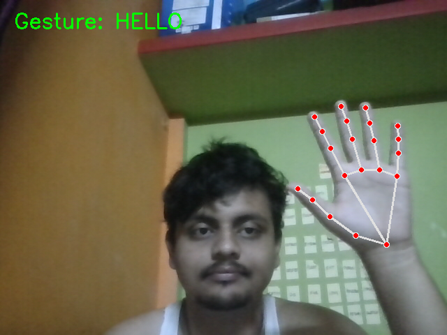

# Mute Child Gesture to Speech System

This project helps mute or speech-impaired children communicate using hand gestures.
Hand gestures are detected using a webcam and converted into speech in real time.

---

## 🎯 Objective
To build an assistive system that converts hand gestures into meaningful voice output.

---

## 🛠 Technologies Used
- Python
- OpenCV
- MediaPipe
- pyttsx3 (Text-to-Speech)

---

## ✋ Supported Gestures

| Gesture | Hand Action | Output |
|-------|------------|--------|
| HELLO | Open palm | Hello |
| YES | Index + Middle | Yes |
| NO | Index only | No |
| WATER | Pinky finger | I want water |
| HELP | Fist | Please help me |
| THANK YOU | Index + Middle + Ring | Thank you |

---

## ▶ How to Run

```bash
python -m app.main

👉 There must be:
- An **opening ```bash**
- A **closing ```**
- A **blank line after**

---

## 🔧 STEP 3: DELETE EVERYTHING BELOW that section  
(Delete your current Output Screenshots text completely)

---

## 🔧 STEP 4: NOW PASTE THIS (FINAL, CLEAN VERSION)

Paste this **fresh**, starting on a **new empty line**:

```markdown
## Output Screenshots

### Gesture Detection – Hello



### Gesture Detection – Yes


### Gesture Detection – No


### Gesture Detection – Water


### Gesture Detection – Help


### Gesture Detection – Thank You


